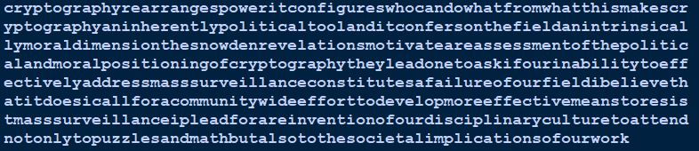

# Task 1

## Task 1.1

In one-time pad, the relation between 2 ciphertexts that share the same key can be shown below. 

```math
{C_1} _\ XOR _\ {C_2} = {P_1} _\ XOR _\ {P_2}
```

"Hi Kimmo" in binary: 

$$ 01001000_\ 01101001_\ 00100000_\ 01001011_\ 01101001_\ 01101101_\ 01101101_\ 01101111 = P_1$$

"No Rauli" in binary:

$$01001110_\ 01101111_\ 00100000_\ 01010010_\ 01100001_\ 01110101_\ 01101100_\ 01101001 = P_2$$

The XOR between of two plaintexts is:

$$00000110_\ 00000110_\ 00000000_\ 00011001_\ 00001000_\ 00011000_\ 00000001_\ 00000110 = X$$

This should be equal to the XOR of the cipher of "No Rauli" and the cipher of "No Kimmo". Therefore XOR between the 

```math
00000110_\ 00000110_\ 00000000_\ 00011001_\ 00001000_\ 00011000_\ 00000001_\ 00000110 = X
```
```math
01101001_\ 00010101_\ 01011111_\ 01001110_\ 00100000_\ 00011100_\ 10101101_\ 01100001 = C_1
```
```math
XOR
```
```math
01101111_\ 00010011_\ 01011111_\ 01010111_\ 00101000_\ 00000100_\ 10101100_\ 01100111 = C_2
```

Therefore, the cipher of "No Rauli" is, 
```
Binary: 01101111 00010011 01011111 01010111 00101000 00000100 10101100 01100111
```
```
Hex: 0x6f135f572804ac67
```

## Task 1.2

The chosen word is **"task1.2!"**

The ciphertext is:
```math
01110100_\ 01100001_\ 01110011_\ 01101011_\ 00110001_\ 00101110_\ 00110010_\ 00100001
```

If the word is longer than 8 characters the XOR operation cannot be executed since the key is only 8 characteer long. To perform one-time pad the plaintext and the key should be in same length. 

## Task 1.3

The one-time pad operation is as:
```math
C = P _\ XOR _\ K
```
The key can be obtained by:
```math
C _\ XOR _\ P = K
```

C : $$01101001_\ 00010101_\ 01011111_\ 01001110_\ 00100000_\ 00011100_\ 10101101_\ 01100001$$

P : $$01001000_\ 01101001_\ 00100000_\ 01001011_\ 01101001_\ 01101101_\ 01101101_\ 01101111$$

Key: 

```
Binary: 00100001 01111100 01111111 00000101 01001001 01110001 11000000 00001110
```
```
Hex: 0x217c7f054971c00e
```

# Task 2

## Task 2.1

**Decrypt the text.**



The text gives the below message. 

_cryptography rearranges power it configures who can do what from what this makes cryptography an inherently political tool and it confers on the field an intrinsically moral dimension the snowden revelations motivate a reassessment of the political and moral positioning of cryptography they lead one to ask if our inability to effectively address mass surveillance constitutes a failure of our field i believe that it does i call for a community wide effort to develop more effective means to resist mass surveillance i plead for a reinvention of our disciplinary culture to attend not only to puzzles and math but also to the societal implications of our work_


**What is the secret key?**

The key is, **random**.

**How many permutations were used?** 2

I used the below Python script to decrypt the ciphertext given in the program. The script can only decrypt the messages with English letters. 

There are 4 separate functions for Vigenere Encryption and Decryption. 
* vigenere: Takes plaintext, key, and a boolean parameter a_is_zero (default to True) as inputs and performs Vigenere encryption.
* vigenere_decrypt: Performs Vigenere decryption, essentially encryption with the inverse key.
* compare_freq: Compares the letter distribution of the given text with normal English using a simple sum of absolute differences for each letter.
* solve_vigenere: Attempts to solve a Vigenere cipher by finding keys such that the plaintext resembles English. The length of the key is defined to be between 1 and 20.

Reference:
* https://gist.github.com/akonradi/a9637c17fc6452d868ee 

```py
import itertools
import string
import sys
import textwrap

# vigenere function is defined here. 
def vigenere(plaintext, key, a_is_zero=True):
    key = key.lower()
    if not all(k in string.ascii_lowercase for k in key):
        raise ValueError("Invalid key!".format(key))
    key_iter = itertools.cycle(map(ord, key))
    return "".join(
        # Calculate the shifted value from 'a'
        chr(ord('a') + ((next(key_iter) - ord('a') + ord(letter) - ord('a')) + (0 if a_is_zero else 2)) % 26)
        if letter in string.ascii_lowercase #Ignore non-alphabetic characters
        else letter
        for letter in plaintext.lower()
    )

# vigenere decryption function 
def vigenere_decrypt(ciphertext, key, a_is_zero=True):
    key_ind = [ord(k) - ord('a') for k in key.lower()]
    inverse = "".join(chr(ord('a') +
            ((26 if a_is_zero else 22) -
                (ord(k) - ord('a'))
            ) % 26) for k in key)
    return vigenere(ciphertext, inverse, a_is_zero)

# From http://code.activestate.com/recipes/142813-deciphering-caesar-code/
ENGLISH_FREQ = (0.0749, 0.0129, 0.0354, 0.0362, 0.1400, 0.0218, 0.0174, 0.0422, 0.0665, 0.0027, 0.0047,
                0.0357, 0.0339, 0.0674, 0.0737, 0.0243, 0.0026, 0.0614, 0.0695, 0.0985, 0.0300, 0.0116,
                0.0169, 0.0028, 0.0164, 0.0004)

def compare_freq(text):
    if not text:
        return None
    text = [t for t in text.lower() if t in string.ascii_lowercase]
    freq = [0] * 26
    total = float(len(text))
    for l in text:
        freq[ord(l) - ord('a')] += 1
    return sum(abs(f / total - E) for f, E in zip(freq, ENGLISH_FREQ))


def solve_vigenere(text, key_min_size=None, key_max_size=None, a_is_zero=True):
    
    best_key = []
    key_min_size = key_min_size or 1
    key_max_size = key_max_size or 20

    text_letters = [c for c in text.lower() if c in string.ascii_lowercase]

    for key_length in range(key_min_size, key_max_size):
        # Try all possible key lengths
        key = [None] * key_length
        for key_index in range(key_length):
            letters = "".join(itertools.islice(text_letters, key_index, None, key_length))
            shifts = []
            for key_char in string.ascii_lowercase:
                shifts.append(
                    (compare_freq(vigenere_decrypt(letters, key_char, a_is_zero)), key_char)
                )
            key[key_index] = min(shifts, key=lambda x: x[0])[1]
        best_key.append("".join(key))
    best_key.sort(key=lambda key: compare_freq(vigenere_decrypt(text, key, a_is_zero)))
    return best_key[:1]

CIPHERTEXT = "TRLSHAXRNSVKIENUFMEGRVDANEELHOFNSLUGIEFZVATAAGCIYAGIFADWUDHFYIFPOWVSPUMBKOTUOBYYNQWZYEEHBFCYCRZUKIPDZFFOYDBPZTPRBRVRFRBFYESLSXUAALBFIIAVWORLYBAAIAYGWYVNFLCZKHRVBANDRQFQMEYDHUFNFPCFZVNWSMIENVGQJSZHBFFFGKSBFLVWWORLNQRYFRNODAJIGLCZZNTRTOIYCWCSIACKMFYELOSMUOAHHARSXLTALRVQONZLVWMFFESISOKIIHZKRDQUSEJMNVGELRIHWXCAAFSOFNFWWFLTRVORRIYXFQFFBXFRZEYGWNVLVHJQKHNWWFUORVWORLYICDRCBPAGEIGBKUUERITAITGRRQMEYRDYFRRHTRVCGLJQDENQGFFRRVWEKMNVGELRIHWXCAAFSUGLRDRRFRNUSUEVRQHUFNBICGIDVVQUGLVQODPCHOHGIEGROFKEAGBAKOAOMFFPHCNXVSNQRYRTUEIFRLFRHAKHRVCOZEGDZUDPYLQMKIBQGAWOHUKAIK"

print ("Solving Vigenere cipher:")
print ("*" * 80)
print (textwrap.fill(CIPHERTEXT, 80))
print ("*" * 80)
for key in reversed(solve_vigenere(CIPHERTEXT)):
    print ("")
    print ("Found key: {!r}".format(key))
    print ("Solution:")
    print ("=" * 80)
    print (textwrap.fill(vigenere_decrypt(CIPHERTEXT, key)))
    print ("=" * 80)
```

# Task 3

## Task 3.1

According to the articles given, the differences between /dev/urandom and /dev/random can be illustrated as below. 

| /dev/random | /dev/urandom |
|-----|-----|
|Blocks when the entropy pool is empty or insufficient. | Doesn't block; provides output even if entropy is low.|
|Relies on environmental noise collected during system operations.|Uses the same environmental noise as /dev/random but employs a pseudorandom number generator (PRNG) for continuous output.|
|Generally considered suitable for cryptographic operations.|May be suitable for cryptographic use, but opinions on this vary.|

The changes in the Linux Kernel, as mentioned earlier, involve converting /dev/random more like /dev/urandom under certain conditions. The blocking behavior of /dev/random has been changed, and it now depends on the Cryptographic Random Number Generator (CRNG) for generating random numbers.

## Task 3.2

The methods I used to generate random numbers are:
1. rolling dice
2. flipping coins
3. random typing on the keyboard
4. roulette wheel assigned with 10 numbers from 0-9

The files are attached [here.](./random-files)

## Task 3.3

I couldn't figure out a way to test the random details. The code I used is `dieharder -a -g 202 -f coin.txt`. But it didn't work.

## Task 3.4

There are few methods that are considered as cryptographically unpredictable. 
1. Devices /dev/urandom and /dev/random on *nix systems
2. BCryptGenRandom on Windows
3. System.Security.Cryptography.RandomNumberGenerator on C# .NET on Windows
4. openssl rand method
5. Kernel syscall getrandom


