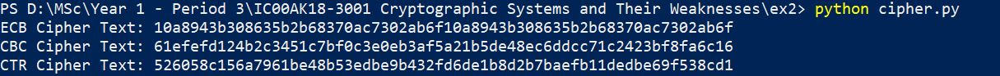
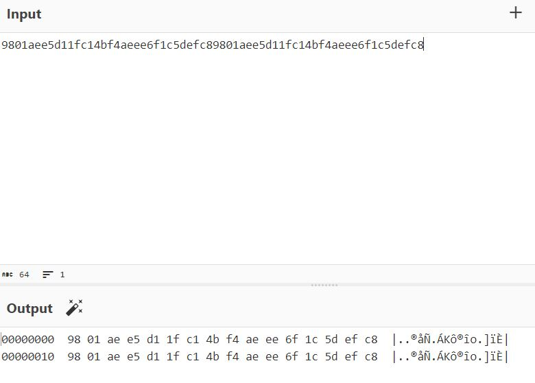
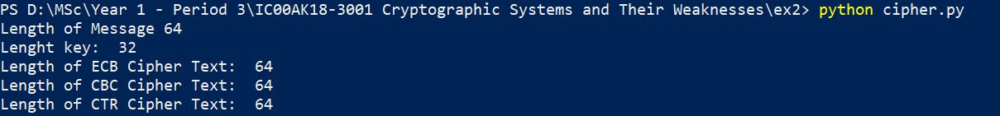
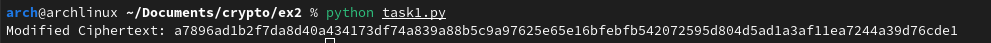

# Task 1

## Task 1.1

I picked python as the language and the crypto library is called **'Crypto**. The script is as follows.

```py
from Crypto.Cipher import AES
from Crypto.Random import get_random_bytes
from Crypto.Util.Padding import pad

# Short message with two identical blocks of 128 bits(all zeroes)
msg = b'\x00\x00\x00\x00\x00\x00\x00\x00'*4

# AES key
key = get_random_bytes(16)

# ECB 
cipher_ecb = AES.new(key, AES.MODE_ECB)
ciphertxt_ecb = cipher_ecb.encrypt(msg)

# CBC 
cipher_cbc = AES.new(key, AES.MODE_CBC)
ciphertxt_cbc = cipher_cbc.encrypt(msg)

# CTR
cipher_ctr = AES.new(key, AES.MODE_CTR)
ciphertxt_ctr = cipher_ctr.encrypt(msg)

print("ECB Cipher Text:", ciphertxt_ecb.hex())
print("CBC Cipher Text:", ciphertxt_cbc.hex())
print("CTR Cipher Text:", ciphertxt_ctr.hex())
```

The cipher text in hex format looks like as below.



As for the comparison, in ECB identical blocks of plaintext result in identical blocks of ciphertext. Here, the first and second blocks of ciphertext are identical. For a better view, I used cyberchef to convert it to hexdump.



ECB divides the plaintext into fixed-size blocks (128 bits for AES) and processes each block independently. Since each block is encrypted independently, identical blocks of plaintext result in identical blocks of ciphertext and this shows that it doesn't hide patterns well.

In CBC, the ciphertext of each block depends on the plaintext of the current block and the ciphertext of the previous block. Since the message is all zeroes, the XOR operation with the initialization vector (IV) introduces some randomness. As a result, even though the plaintext blocks are identical, the ciphertext blocks are not. CBC XORs each plaintext block with the ciphertext of the previous block. The first block is XORed with a random IV key. This avoids generating the same pattern and it is more secure than the ECB when the plaintext blocks are identical. 

CTR executes the XOR function between the plaintext block and a keystream generated from the key and nonce. Each block of ciphertext is generated independently of others, making CTR mode highly parallelizable. The nonce ensures that even if the same key is used, a different keystream is generated. Counter values ensure that each block is encrypted with a different part of the keystream, providing randomization. Since the nonce is different for each encryption, even with the same plaintext, the keystream and consequently the ciphertext differ.

**Salt:** Salt is a random value that is typically added to passwords before processing in password-based systems. It prevents attackers from using precomputed dictionaries of common passwords by requiring them to create a unique dictionary for each possible salt value. This makes dictionary attacks more challenging and adds a layer of security to password storage.

**Nonce:** A nonce (number used once) is data used in cryptographic protocols and algorithms, often for message authentication codes and some encryption modes. Nonces should be unique for each use with a specific cryptographic key. The nonce in this case helps ensure the uniqueness of each authentication session. It prevents replay attacks by making sure that the values used in the authentication process are never repeated.


## Task 1.2

The indistinguishability properties are influenced by factors like determinism, IV usage, and security guarantees under chosen plaintext attacks. The three modes of operation in AES (Electronic Codebook (ECB), Cipher Block Chaining (CBC), and Counter (CTR)) have different properties, including their impact on indistinguishability and security. Each mode has its strengths and weaknesses, and the choice depends on specific requirements and considerations. 

* ECB: Identical plaintext blocks produce identical ciphertext blocks, leading to a lack of semantic security. This means that patterns in the plaintext are directly visible in the ciphertext, making it vulnerable to various attacks. While suitable for some specific use cases, ECB is generally not recommended for encrypting multiple blocks of data with the same key. It doesn't provide the level of security needed for many practical applications, especially when used with messages longer than one block or when keys are reused.

* CBC: CBC relies on initialization vectors (IVs) for security. It introduces an Initialization Vector (IV) and XORs each plaintext block with the previous ciphertext block before encryption. This prevents identical plaintext blocks from encrypting to the same ciphertext blocks. It achieves Semantic Security under Chosen Plaintext Attacks (SemCPA) when using a random IV. CBC is more secure than ECB in terms of indistinguishability. However, care must be taken with the management of the IV, and padding schemes need to be considered to avoid certain vulnerabilities. The CBC, while widely used, has disadvantages compared to CTR. However, it is still included in cryptographic portfolios due to its extensive use.

* CTR: CTR is considered the "best" choice among confidentiality modes. It essentially turns a block cipher into a stream cipher, generating a unique key stream for each block. As a result, identical plaintext blocks are encrypted to different ciphertext blocks. It achieves unsurpassed performance and provable security guarantees compared to others. It provides Semantic Security under Chosen Plaintext Attacks (SemCPA). CTR mode is considered secure and is widely used. It allows for parallel encryption, making it efficient for certain applications. CTR requires careful management of counter values to avoid reuse, and it offers no authenticity or chosen-ciphertext-attack security.

Reference: 
* https://web.cs.ucdavis.edu/~rogaway/papers/modes.pdf


## Task 1.3

I updated the same code above so that the length of the ciphertext and so that we could see the lengths of the ciphertexts. 

```py
from Crypto.Cipher import AES
from Crypto.Random import get_random_bytes
from Crypto.Util.Padding import pad

# Short message with two identical blocks of 128 bits(all zeroes)
msg = b'\x00\x00\x00\x00\x00\x00\x00\x00'*4

# AES key
key = get_random_bytes(16)

# ECB 
cipher_ecb = AES.new(key, AES.MODE_ECB)
ciphertxt_ecb = cipher_ecb.encrypt(msg)

# CBC 
cipher_cbc = AES.new(key, AES.MODE_CBC)
ciphertxt_cbc = cipher_cbc.encrypt(msg)

# CTR
cipher_ctr = AES.new(key, AES.MODE_CTR)
ciphertxt_ctr = cipher_ctr.encrypt(msg)

print("Length of Message", len(msg.hex()))
print("Lenght key: ", len(key.hex()))
print("Length of ECB Cipher Text: ", len(ciphertxt_ecb.hex()))
print("Length of CBC Cipher Text: ", len(ciphertxt_cbc.hex()))
print("Length of CTR Cipher Text: ", len(ciphertxt_ctr.hex()))

# print("ECB Cipher Text:", ciphertxt_ecb.hex())
# print("CBC Cipher Text:", ciphertxt_cbc.hex())
# print("CTR Cipher Text:", ciphertxt_ctr.hex())
```



As per the above image, the lengths of the ciphertexts are all similar. In this case, all three modes result in ciphertext lengths equal to the length of the original message. This is because I have a message size that is already a multiple of the block size (16 bytes for AES). If the message length is not a multiple of the block size, padding would be added, affecting the ciphertext length. The command of the ECB and CBC encryption should also be changed as:

`ciphertxt_ecb = cipher_ecb.encrypt(pad(msg, AES.block_size))` & `ciphertxt_cbc = cipher_cbc.encrypt(pad(msg, AES.block_size))`

# Task 2

### Task 2.1.1

**RSA Key generation:**

```terminal
arch@archlinux ~/Documents/crypto/ex2 % time openssl genrsa -out rsa_key_legacy.pem 3072
openssl genrsa -out rsa_key_legacy.pem 3072  0.35s user 0.12s system 97% cpu 0.481 total
arch@archlinux ~/Documents/crypto/ex2 % time openssl genpkey -algorithm RSA -out rsa_key_new.pem -aes256
....+..+.......+..+...+.+......+......+........+++++++++++++++++++++++++++++++++++++++*.........+...+...+.......+...+.....+....+++++++++++++++++++++++++++++++++++++++*...................+...+.........+...+.....+.......+...+...+.....+....+..+.+..+..........+..+......+....+......+...+..+...+...............+.+.....+....+...........+...+...+.......+...........+.........+.+..+.......+........+.......+.....+...+...+.+......+...+...............+..+...+......++++++
........+...+.......+.....+......+............+++++++++++++++++++++++++++++++++++++++*...+........+.......+......+..+....+...+..+.+...............+.........+...+...+..+++++++++++++++++++++++++++++++++++++++*......+.....+....+..+....+.....+.+.....+...............+......................+..+...+.............+...+..+.............+...........+.............+..+.+..+.......+.....+.........+.......+....................+.......+............+.....+....+.....+......+.+...+.....+.........................+..+.......+..+...++++++
Enter PEM pass phrase:
Verifying - Enter PEM pass phrase:
openssl genpkey -algorithm RSA -out rsa_key_new.pem -aes256  0.17s user 0.04s system 5% cpu 3.586 total
arch@archlinux ~/Documents/crypto/ex2 % 
```

As observed, the legacy `genrsa` command for generating an RSA key with a key length of 3072 bits is significantly faster (0.481 seconds) compared to the newer genpkey command for RSA with AES encryption (3.586 seconds). But the user time and system time is lower in `genpkey` key generation. 

**ECDSA key generation:**

```terminal
arch@archlinux ~/Documents/crypto/ex2 % time openssl ecparam -genkey -name secp256r1 -out ecdsa_key_secp256r1.pem
using curve name prime256v1 instead of secp256r1
openssl ecparam -genkey -name secp256r1 -out ecdsa_key_secp256r1.pem  0.03s user 0.02s system 62% cpu 0.075 total
arch@archlinux ~/Documents/crypto/ex2 % time openssl ecparam -genkey -name prime256v1 -out ecdsa_key_curve25519.pem
openssl ecparam -genkey -name prime256v1 -out ecdsa_key_curve25519.pem  0.01s user 0.01s system 95% cpu 0.017 total
arch@archlinux ~/Documents/crypto/ex2 % time openssl genpkey -algorithm Ed25519 -out eddsa_key_curve25519.pem
openssl genpkey -algorithm Ed25519 -out eddsa_key_curve25519.pem  0.02s user 0.01s system 96% cpu 0.026 total
arch@archlinux ~/Documents/crypto/ex2 % 
```
Generating an ECDSA key (secp256r1 curve) took 0.075 seconds. Generating another ECDSA key (prime256v1 curve, equivalent to curve25519) took 0.017 seconds. Generating an EdDSA key (Ed25519 algorithm) took 0.026 seconds. The time difference is likely due to the complexity of the elliptic curve parameters and the operations involved in generating keys for different curves. Anyway, these times are relatively low.

**Public key generation:**

```terminal
arch@archlinux ~/Documents/crypto/ex2 % openssl rsa -pubout -in rsa_key_legacy.pem -out rsa_key_legacy_pub.pem
writing RSA key
arch@archlinux ~/Documents/crypto/ex2 % openssl rsa -pubout -in rsa_key_new.pem -out rsa_key_new_pub.pem
Enter pass phrase for rsa_key_new.pem:
writing RSA key
arch@archlinux ~/Documents/crypto/ex2 % openssl ec -pubout -in ecdsa_key_secp256r1.pem -out ecdsa_key_secp256r1_pub.pem
read EC key
writing EC key
arch@archlinux ~/Documents/crypto/ex2 % openssl ec -pubout -in ecdsa_key_curve25519.pem -out ecdsa_key_curve25519_pub.pem
read EC key
writing EC key
arch@archlinux ~/Documents/crypto/ex2 % openssl pkey -pubout -in eddsa_key_curve25519.pem -out eddsa_key_curve25519_pub.pem
arch@archlinux ~/Documents/crypto/ex2 % 
```


### Task 2.1.2

The public keys are:

```terminal
rch@archlinux ~/Documents/crypto/ex2 % cat rsa_key_legacy_pub.pem
-----BEGIN PUBLIC KEY-----
MIIBojANBgkqhkiG9w0BAQEFAAOCAY8AMIIBigKCAYEAppgdVxGm3SVALUHDtM28
lqz+oF5UY0EeHyP6GinDr2qkGhp+KPksEUEX6Oryy7zrXMWIdRPhdgYsKFENDQoO
q5kAK56rvRg39EOTiJ9LIoXiFk3KKdsqJtVxuKWamg9kpia9rJfRuAVD0uEAQx7C
E1O2LPGIHIV6VVUuz2RSuD3BaQBuJuH4eWduXb/MB0dLcNbkzsXp0XYHbRHQVfTi
PKL9jwLVs3VosyvL4niG1wJu5nNcGbwF+Dx8TbyOBj6Z3EiGGfNA8VZHQRTDZ47R
PypIyMxDlxgOiaedtm36PJx5AZDfg6zg3x6iAdLl6906HKT49mu+M/lJaYTX3qgg
6oHj1dzXLFVMrQMFTJx7b2lGcOJ7HHx3bgXT0cuhRphSg0AqdwyjqKaEUy8bXbbg
UF8J2FLDWu057kMSjpGd5HHutE3ArOJX7sBidtv40NTFkjd97Sc9YyaQv5UrJ6Qm
lQ8et4+b23rhmyYa0oKHpL2TuDpXjkzQsXuhp/CcpWJ3AgMBAAE=
-----END PUBLIC KEY-----
arch@archlinux ~/Documents/crypto/ex2 % cat rsa_key_new_pub.pem   
-----BEGIN PUBLIC KEY-----
MIIBIjANBgkqhkiG9w0BAQEFAAOCAQ8AMIIBCgKCAQEA1SKhQb0530SBdzw2Je3z
XPLhekkgFuL56j6T5ekGPIhtihA4zTyJGKXrRAdEsD81gOHmgNLnyBLhl/VYizLt
MZiC/B3+Y5TfEVLGC77HTuYtWC1+hPSC9HkCF+HHanKcnPWrCSPz1mrv2RvaAH01
x93gvxamdiUpyXookAGVdSjlL6z9SXWKg3l6QIKyGE08UcpapXW8NjqyjVVT/u/y
Nk0351l4cx4QG1eJ8Qq8Eq7aZAXsBCfky0UN/R12ie4+qR0clQbjGsbASOAFXXXp
9SnSBBSwKzMAn7KaS3rATCtWgg2l5eREEuq5tBZg0HRQG5BmnqDrtkpUiPvTSXc7
lQIDAQAB
-----END PUBLIC KEY-----
```

Looking at the header of the private keys, it can be concluded that the legacy command `genrsa` has used PKCS#1 format, and the new command `genpkey` has used PKCS#8 command. 

### Task 2.1.3

The practical differences between the curves secp256r1 and Curve25519 are as follows:

1. Speed: Curve25519 is generally faster than secp256r1. This is because Curve25519 is specifically designed for speed, while secp256r1 is a more general-purpose curve.
2. Security: Curve25519 is considered to be at least as secure as secp256r1. In fact, some experts believe that Curve25519 is slightly more secure.
3. Key size: Both curves have a 256-bit key size. However, Curve25519 uses a more efficient encoding scheme, which means that it can store the same amount of information in a smaller amount of space.
4. Cofactor: The cofactor of a curve is the number of points on the curve. Curve25519 has a cofactor of 8, while secp256r1 has a cofactor of 1. This means that Curve25519 has more points on the curve, which can make it faster for some operations.
5. Curve type: Curve25519 is an Edwards curve, while secp256r1 is a Weierstrass curve. Edwards curves can be more efficient for some operations, but they are also more complex to implement.
6. Use cases: Curve25519 is a good choice for applications where speed is important, such as TLS (Transport Layer Security) and SSH (Secure Shell). secp256r1 is a good choice for applications where security is the most important concern, such as Bitcoin.

Reference: https://cryptobook.nakov.com/asymmetric-key-ciphers/elliptic-curve-cryptography-ecc

### Task 2.1.4

Based on the execution times for key generation, there are noticeable time differences between the tested algorithms. In RSA Key Generation the new `genpkey` command for RSA key generation is significantly faster than the legacy `genrsa` command. In ECDSA Key Generation the key generation for the prime256v1 curve (secp256r1) is faster than the secp256r1 curve. Both, however, are relatively fast. The EdDSA key generation using Curve25519 is reasonably fast.

### Task 2.1.5

There are a few reasons that the DSA/ECDSA algorithm be considered as problematic and the EdDSA considered as a better alternative. 
* DSA and ECDSA require the use of a randomly generated unpredictable and secret value called a nonce. If the nonce is not generated properly, it can be vulnerable to side-channel attacks. EdDSA, on the other hand, generates the nonce in a deterministic way, which makes it more resistant to side-channel attacks.
* If a collision is found in the hash function used by DSA or ECDSA, it can be used to forge signatures. EdDSA, on the other hand, uses a hash function that is resistant to collisions, making it more secure.
* DSA and ECDSA can be relatively slow to compute, especially on resource-constrained devices. EdDSA is generally faster than DSA and ECDSA, making it a better choice for applications where performance is important.

However, EdDSA is becoming increasingly popular for use in a variety of applications, including SSH, TLS, and Bitcoin.

# Task 3

## Task 3.1

Code:

```py
import binascii
import hashlib  # Add this import
from Crypto.Cipher import AES

def new_ciphertext(original_ct, original_pt, desired_pt):
    
    original_ct_bytes = binascii.unhexlify(original_ct)
    original_pt_bytes = original_pt.encode('utf-8')
    desired_pt_bytes = desired_pt.encode('utf-8')

    # Calculate new ciphertext
    new_ct_bytes = bytes(
        original_byte ^ (original_pt_byte ^ desired_pt_byte)
        for original_byte, original_pt_byte, desired_pt_byte
        in zip(original_ct_bytes, original_pt_bytes, desired_pt_bytes)
    )
    modified_ct_hex = binascii.hexlify(new_ct_bytes).decode('utf-8')

    return modified_ct_hex

original_ct = "a7896ad1b2f7da8d40b33d1438e04a839a88b5c9a97625fe5017a5e1fb542072595d804d5ad1a3af11ea7244a39d76cde1"
original_pt = "Move the tables to the patio as soon as possible!"
desired_pt = "Move the chairs to the house as soon as possible!"
modified_ct = new_ciphertext(original_ct, original_pt, desired_pt)

print("Modified Ciphertext:", modified_ct)
```

Output:



## Task 3.2

The provided code fails to address the complexities of modifying ciphertext in AES-CTR mode, relying on an oversimplified byte-wise XOR operation that disregards the underlying block structure and keystream generation process. The AES in CTR mode doesn't operate as a one-time pad, processing data in blocks of 16 bytes. Applying simple byte-wise XORs within a block can lead to unintended and unpredictable modifications due to the interplay of block operations. Handling incomplete blocks is crucial in CTR mode, as modifications to the last block may affect the overall decryption process. The code's lack of attention to incomplete blocks can introduce inconsistencies and errors. The CTR mode relies on a keystream generated by encrypting the counter value. Modifying this keystream directly can compromise the encryption's security, necessitating careful handling and synchronization between sender and receiver. The code's disregard for keystream manipulation raises serious security concerns.

## Task 3.3


Modifying ciphertext without proper understanding and adherence to specific constraints can lead to unintended consequences and compromise the security of the encryption process. Block size, CTR mode, and block structure play crucial roles in ensuring the integrity of modified ciphertext. Block size limitations dictate that modifications must align with the cipher's block size, ensuring that changes are made at the block level, not individual bytes. In AES, for instance, this means modifying 16-byte blocks. CTR mode introduces additional considerations, as modifications should account for the counter and nonce values used in this mode. Tampering with these values can disrupt synchronization between sender and receiver, rendering the modified ciphertext unusable. Understanding the block structure of the cipher is essential for making meaningful modifications. Simply XORing bytes without considering the block layout may not yield the desired results.
