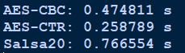
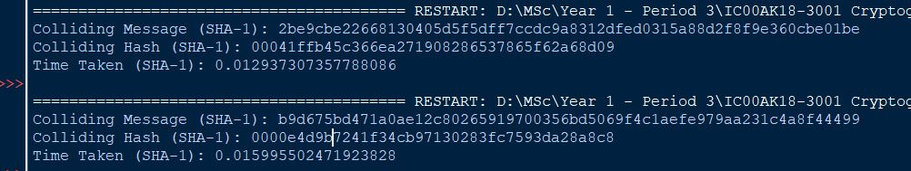
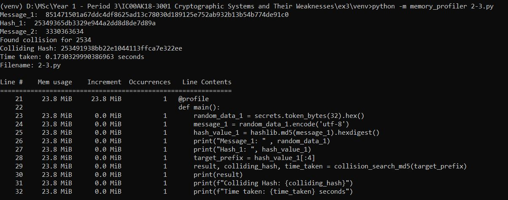
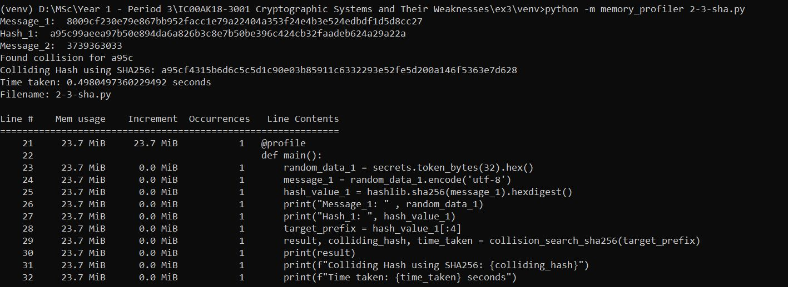
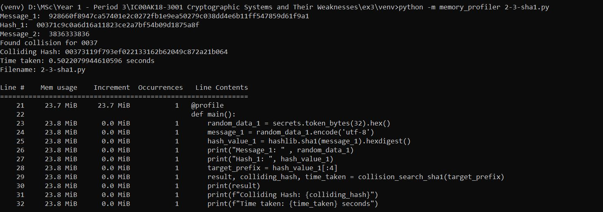
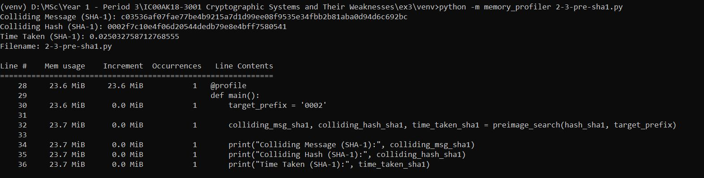

# Task 1

## Task 1.1

The script used for the key generation, encryption and decryption is shown below. 

```py
from Crypto.Cipher import Salsa20
from Crypto.Random import get_random_bytes

def generate_keystream(key, nonce, length):
    cipher = Salsa20.new(key=key, nonce=nonce)
    return cipher.encrypt(bytes(length))

def encrypt(plaintext, keystream):
    plaintext_bytes = plaintext.encode('utf-8')
    ciphertext_bytes = bytes(plain_byte ^ key_byte for plain_byte, key_byte in zip(plaintext_bytes, keystream))
    return ciphertext_bytes.hex()

def decrypt(ciphertext, keystream):
    ciphertext_bytes = bytes.fromhex(ciphertext)
    decrypted_bytes = bytes(cipher_byte ^ key_byte for cipher_byte, key_byte in zip(ciphertext_bytes, keystream))
    return decrypted_bytes.decode('utf-8')

key = get_random_bytes(32)  # 256-bit key
nonce = get_random_bytes(8)  # 64-bit nonce

plaintext_original_1 = "Move the tables to the patio as soon as possible!"
plaintext_original_2 = "Move the chairs to the house as soon as possible!"

# keystream with same length of plaintext
keystream = generate_keystream(key, nonce, len(plaintext_original_1.encode('utf-8')))

# Encryption
ciphertext_1 = encrypt(plaintext_original_1, keystream)
print("Ciphertext_1:", ciphertext_1)

ciphertext_2 = encrypt(plaintext_original_2, keystream)
print("Ciphertext_2:", ciphertext_2)

# Decryption
decrypted_text_1 = decrypt(ciphertext_1, keystream)
print("Decrypted Text 1:", decrypted_text_1)

decrypted_text_2 = decrypt(ciphertext_2, keystream)
print("Decrypted Text 2:", decrypted_text_2)

```

Here I have used Salsa20 stream cipher. The output is as follows. 

```terminal
Ciphertext_1: 23bb91f07a530e60c9ff2af68890161b503538206e080db50d61c1ed77aac8874baf9fc89199ceb4b2dd84abbb7e4ca3a9
Ciphertext_2: 23bb91f07a530e60c9e823f58d87161b503538206e080dad0360dbe777aac8874baf9fc89199ceb4b2dd84abbb7e4ca3a9
Decrypted Text 1: Move the tables to the patio as soon as possible!
Decrypted Text 2: Move the chairs to the house as soon as possible!
```

There are similar parts of the ciphertexts but not the whole ciphertext. Since we use the same key and nonce for the both plaintexts, after the XOR operation it generates the similar ciphertexts for the similar plaintexts. 

## Task 1.2

The script is as follows:

```py
from Crypto.Cipher import Salsa20
from Crypto.Random import get_random_bytes

def generate_keystream(key, nonce, length):
    cipher = Salsa20.new(key=key, nonce=nonce)
    return cipher.encrypt(bytes(length))

def encrypt(plaintext, keystream):
    plaintext_bytes = plaintext.encode('utf-8')
    ciphertext_bytes = bytes(plain_byte ^ key_byte for plain_byte, key_byte in zip(plaintext_bytes, keystream))
    return ciphertext_bytes.hex()

def decrypt(ciphertext, keystream):
    ciphertext_bytes = bytes.fromhex(ciphertext)
    decrypted_bytes = bytes(cipher_byte ^ key_byte for cipher_byte, key_byte in zip(ciphertext_bytes, keystream))
    return decrypted_bytes.decode('utf-8')

key_1 = get_random_bytes(32)  # 256-bit key 1
key_2 = get_random_bytes(32)  # 256-bit key 2
nonce = get_random_bytes(8)  # 64-bit nonce

plaintext_original_1 = "cryptography"
plaintext_original_2 = "kryptography"

# keystream with same length of plaintext
keystream_1 = generate_keystream(key_1, nonce, len(plaintext_original_1.encode('utf-8')))
keystream_2 = generate_keystream(key_2, nonce, len(plaintext_original_2.encode('utf-8')))

# Encryption
ciphertext_1 = encrypt(plaintext_original_1, keystream_1)
print("Cryptography:", ciphertext_1)

##ciphertext_21 = encrypt(plaintext_original_2, keystream_1)
##print("Kryptography_21:", ciphertext_21)

ciphertext_2 = encrypt(plaintext_original_2, keystream_2)
print("Kryptography:", ciphertext_2)

# Decryption
decrypted_text_1 = decrypt(ciphertext_1, keystream_1)
print("Decrypted Text 1:", decrypted_text_1)

decrypted_text_2 = decrypt(ciphertext_2, keystream_2)
print("Decrypted Text 2:", decrypted_text_2)
```

The output is:
```terminal
= RESTART: D:\MSc\Year 1 - Period 3\IC00AK18-3001 Cryptographic Systems and Their Weaknesses\ex3\2.py
Cryptography: e56405379ac61c53e1f87a8b
Kryptography: 86bf324d477758537218561b
Decrypted Text 1: cryptography
Decrypted Text 2: kryptography
```

As per the output shown, there are no similarities between the ciphertexts can be seen. Since different keys are used the keystream is different and that makes the ciphertexts different. 

## Task 1.3

The time for each encryption can be measured using the ```timeit``` library in python. 

The script is as follows:

```py
import timeit
from Crypto.Cipher import AES, Salsa20
from Crypto.Random import get_random_bytes

def encrypt_aes_cbc(key, plaintext):
    cipher = AES.new(key, AES.MODE_CBC)
    return cipher.encrypt(plaintext)

def encrypt_aes_ctr(key, plaintext):
    cipher = AES.new(key, AES.MODE_CTR)
    return cipher.encrypt(plaintext)

def encrypt_salsa20(key, plaintext):
    cipher = Salsa20.new(key=key, nonce=get_random_bytes(8))
    return cipher.encrypt(plaintext)

key = get_random_bytes(16)  # 128-bit key
plaintext = b'a' * 10240  # 10 KB plaintext

# AES-CBC
time_aes_cbc = timeit.timeit(lambda: encrypt_aes_cbc(key, plaintext), number=10000)

# AES-CTR
time_aes_ctr = timeit.timeit(lambda: encrypt_aes_ctr(key, plaintext), number=10000)

# Salsa20 stream cipher
time_salsa20 = timeit.timeit(lambda: encrypt_salsa20(key, plaintext), number=10000)

print(f"AES-CBC: {time_aes_cbc:.6f} s")
print(f"AES-CTR: {time_aes_ctr:.6f} s")
print(f"Salsa20: {time_salsa20:.6f} s")

```

Output:



The time taken for the AES-CTR and AES_CBC encryption is considerably smaller compared to the time taken for the Salsa20 stream cipher encryption. My PC is hardware encryption supported and therefore AES encryption is faster due to the hardware acceleration. 

# Task 2

## Task 2.1

```py
import hashlib
import time

def partial_collision_search(hash_function, target_prefix, num_iterations=5000000):
    start_time = time.time()

    for i in range(num_iterations):
        message = f"Collision attempt {i}"
        hash_value = hash_function(message.encode()).hexdigest()

        # Check if the hash value starts with the target prefix
        if hash_value.startswith(target_prefix):
            end_time = time.time()
            time_taken = end_time - start_time
            return message, hash_value, time_taken

    return None, None, None

def main():
    target_prefix = "beef"  
    hash_md5 = hashlib.md5
    hash_sha256 = hashlib.sha256
    hash_sha1 = hashlib.sha1

    colliding_msg_md5, colliding_hash_1, time_taken_1 = partial_collision_search(hash_md5, target_prefix)
    colliding_msg_sha256, colliding_hash_2, time_taken_2 = partial_collision_search(hash_sha256, target_prefix)
    colliding_msg_sha1, colliding_hash_3, time_taken_3 = partial_collision_search(hash_sha1, target_prefix)

    if colliding_msg_md5 is not None:
        print(f"Colliding msg md5: {colliding_msg_md5}")
        print(f"Colliding Hash md5: {colliding_hash_1}")
        print(f"Time taken md5: {time_taken_1:.6f} seconds")
        print(" ")

        print(f"Colliding msg sha256: {colliding_msg_sha256}")
        print(f"Colliding Hash sha256: {colliding_hash_2}")
        print(f"Time taken sha256: {time_taken_2:.6f} seconds")
        print(" ")

        print(f"Colliding msg sha1: {colliding_msg_sha1}")
        print(f"Colliding Hash sha1: {colliding_hash_3}")
        print(f"Time taken sha1: {time_taken_3:.6f} seconds")

    else:
        print("No collision found within the specified iterations.")

if __name__ == "__main__":
    main()

```

Three hash algorithms have been compared that how much time it takes to find a collision. The algorithms are MD SHA256 and SHA-1. Te target prefix is 4 bytes. The output appears as below.

```terminal
Colliding msg md5: Collision attempt 32578
Colliding Hash md5: beef15aed73b1ae8a4a09719fcc96cf8
Time taken md5: 0.176083 seconds
 
Colliding msg sha256: Collision attempt 74856
Colliding Hash sha256: beefca84424f7723edad378aee331aa30210ae0980ff6402baf33ae13511075d
Time taken sha256: 0.155933 seconds
 
Colliding msg sha1: Collision attempt 23952
Colliding Hash sha1: beefa06e12f0c17ae91dd9fb25b25e9b5583f2bb
Time taken sha1: 0.036002 seconds
```

As it seems the the messages are different and the time taken has slight difference among them. The SHA-1 has collision in lowest amount of time. 

## Task 2.2

```py
import time
import secrets
import hashlib

def preimage_search(hash_function, target_prefix, num_iterations=100000):
    start_time = time.time()

    for i in range(num_iterations):
        random_data = secrets.token_bytes(32)
        message = random_data.hex()
        hash_value = hash_function(message)

        # Check if the hash value starts with the target prefix
        if hash_value.startswith(target_prefix):
            end_time = time.time()
            time_taken = end_time - start_time
            
            return message, hash_value, time_taken

    return None, None, None

def hash_sha1(message):
        
    return hashlib.sha1(message.encode('utf-8')).hexdigest()

def main():
    target_prefix = '000'
    
    colliding_msg_sha1, colliding_hash_sha1, time_taken_sha1 = preimage_search(hash_sha1, target_prefix)
    
    print("Colliding Message (SHA-1):", colliding_msg_sha1)
    print("Colliding Hash (SHA-1):", colliding_hash_sha1)
    print("Time Taken (SHA-1):", time_taken_sha1)

if __name__ == "__main__":
    main()

```

I considered the SHA-1 function and with 3 zero bytes. The output at a one time is as follows.

```terminal
Colliding Message (SHA-1): 2be9cbe22668130405d5f5dff7ccdc9a8312dfed0315a88d2f8f9e360cbe01be
Colliding Hash (SHA-1): 00041ffb45c366ea271908286537865f62a68d09
Time Taken (SHA-1): 0.012937307357788086
```

The message string differes at each time the code runs. 



## Task 2.3

| Search Type | Hash Function | Original Message | Forged message | Original Hash                    | Collision/preimage | Time measurement/memory usage |Output|
|-------------|---------------|------------------|----------------|----------------------------------|--------------------|-------------------------------|--------|
| Collision   | MD5| 851471501a67ddc4df8625ad13c78030d189125e752ab932b13b54b774de91c0    | 3330363634 | 25349365db3329e944a2dd8d8de7d89a | 253491938bb22e1044113ffca7e322ee|0.173033 S/23.8 MiB | |
| Collision   | SHA256| 8009cf230e79e867bb952facc1e79a22404a353f24e4b3e524edbdf1d5d8cc27    | 3739363033 | a95c99aeea97b50e894da6a826b3c8e7b50be396c424cb32faadeb624a29a22a | a95cf4315b6d6c5c5d1c90e03b85911c6332293e52fe5d200a146f5363e7d628| 0.49805 S/23.7 MiB ||
| Collision   | SHA-1| 928660f8947ca57401e2c0272fb1e9ea50279c038dd4e6b11ff547859d61f9a1    | 3836333836 | 00371c9c0a6d16a11823ce2a7bf54b09d1875a8f | 00373119f793ef022133162b62049c872a21b064|0.502208 S/23.8 MiB | |
| Preimage   | SHA-1| -    | c03536af07fae77be4b9215a7d1d99ee08f9535e34fbb2b81aba0d94d6c692bc | 0002...... | 0002f7c10e4f06d20544dedb79e8e4bff7580541|0.02503276 S/23.7 MiB ||


# Task 3

The code:

```py
def hex_to_ascii(hex_str):
    return bytes.fromhex(hex_str).decode('ascii')

def xor_hex_strings(hex_str1, hex_str2):
    int1 = int(hex_str1, 16)
    int2 = int(hex_str2, 16)
    result = int1 ^ int2
    return '{:02x}'.format(result)

def decrypt_single_ciphertext(ciphertext, xor_result):
    return [xor_hex_strings(x, y) for x, y in zip(xor_result, ciphertext)]

def decrypt_all_messages(ciphertexts):
    num_messages = len(ciphertexts)
    message_length = len(ciphertexts[0])
    xor_result = ['00'] * message_length

    decrypted_messages_hex = []
    for ciphertext in ciphertexts:
        xor_result = decrypt_single_ciphertext(ciphertext, xor_result)
        decrypted_message_hex = ''.join(xor_result)
        decrypted_messages_hex.append(decrypted_message_hex)

    concatenated_message_hex = ''.join(decrypted_messages_hex)

    return concatenated_message_hex

ciphertexts_hex = [
    "c893b56d652e0fadc4f945e99e0aef6f634880c27b68979b2329805fa3e34ecb209f11bebce48f9e46a9c741a1a5e21ea910",
    "c495f03a77295da58ff259e7d916f326725389c3352c818b6d339a10acb34fcf25cb18f0b0ad88d640e1cd43eea8fc17f30b",
    "c483b5736a2940ec8cf244a09b10fe2e7353cccf352c978c23258819ade1488238d050b5aba79a8646a9d045abe6ff04e502",
    "8190fc74607d5ca08deb47e59d42ea3a694487ca222c828a712f9b18aab348ca299f17bcb9b788d647e6cb5fbde6e60ba911",
    "c884e17576240fa185f544e9960ce86f744f83d33c64d68c6c34ce0eb7fa5fc920c650b5b6ab8e914ba9d042eeb6fb08ff02",
    "cf93b57b242e58a596f717ef9f42fc3d695398df7b6883917760880dadfe1cc722cb15a2b1aa9cd642e5cb43a9e6fe04fd0f",
    "818ffc7770354aec8cfa5bec8e03e26f734a89ca2f2c998423228116aef658822fde12b2b9a39ed642e7c00da1aaed4dfb06",
    "c6c7f87b702e0fad90bb58ee9c42fe21640783c07b6582c262608d10aefc49d029db50a0b7b78f9351a9d042a1e6e50cfb00",
    "c4c7f375767d46a280f458f2d906f23c704b8ddf7b64978623228b1aacb348c32fd415b4f8b094d657e1c10db9a7e501a90e",
    "d5c7f17f74344cb881ff17f3900feb2379078dc87b69988d712d810ab1b35ac32fda50bdb7b69ed657e1c543eea7a900ec13"
]

concatenated_message_hex = decrypt_all_messages(ciphertexts_hex)

print(f"Concatenated Message (hex): {concatenated_message_hex}")

import string

ENGLISH_FREQ = (0.0749, 0.0129, 0.0354, 0.0362, 0.1400, 0.0218, 0.0174, 0.0422, 0.0665, 0.0027, 0.0047,
                0.0357, 0.0339, 0.0674, 0.0737, 0.0243, 0.0026, 0.0614, 0.0695, 0.0985, 0.0300, 0.0116,
                0.0169, 0.0028, 0.0164, 0.0004)

def xor_hex_strings(hex_str1, hex_str2):
    int1 = int(hex_str1, 16)
    int2 = int(hex_str2, 16)
    result = int1 ^ int2
    return '{:02x}'.format(result)

def compare_freq(text):
    if not text:
        return None    
    text = [t for t in text.lower() if t in string.ascii_lowercase]
    if not text:
        return float('inf')
    freq = [0] * 26
    total = float(len(text))    
    for l in text:
        freq[ord(l) - ord('a')] += 1
    return sum(abs(f / total - E) for f, E in zip(freq, ENGLISH_FREQ))

def decrypt_and_guess_key(concatenated_text_hex):
    best_guess = None
    best_score = float('inf')

    for key in range(256):
        key_hex = format(key, '02x')
        decrypted_text_hex = ''.join(xor_hex_strings(concatenated_text_hex[i:i+2], key_hex) for i in range(0, len(concatenated_text_hex), 2))
        
        try:
            decrypted_text = bytes.fromhex(decrypted_text_hex).decode('ascii')
        except UnicodeDecodeError:
            decrypted_text = bytes.fromhex(decrypted_text_hex).decode('latin-1')

        score = compare_freq(decrypted_text)
        
        if score < best_score:
            best_score = score
            best_guess = decrypted_text

    return best_guess

guessed_text = decrypt_and_guess_key(concatenated_message_hex)

print(f"Guessed Text: {guessed_text}")

```

The guessed output is:

```terminal
Concatenated Message (hex): 0c0809030b05060d0605020e000f0a0d0c040f0904050e09090e000a0e0f060f0603040808000c02070b06080907090b020302090800050f0a030e03040e0c0b0200090f01010b0e0b0c0e04080f090e04060a090c0704010a010a050e02010e0a090100000c0006040505070102000705020008040b000b010c000e0407010c010c04090101010b00090001040e040401060100040e010a010a040f000f050000010004000505040009040e000c04090007040800060408000a0002040f000d010e0009050a010b0c0808050f0002040708020e01020e040c070f0905080a0e0d0c000c0e020607060204080c050c0e070b06080801090c060d030f090205060a020b0104090806030d080405090f0b0a070e0e090d0c0e04000e010d0a04070e040e0b0e01000d0b0f010904090105000c050001080503040e0404040a0102010f040b0401040e0008050d000b000c040200040509040400030106010c01000009040e000800020001040c0104010b040e0407010e05090105010800070007010101080509000d0007000601060008080109010e0d0205060e070704010e050c0f0e07050b0a020d0704020e000302070f04030c010d07060502000d05090a070002040c0704000b0f0f08050e080503040d0d010e0f020a080f02090b0809040c0a0e0c01050a0b070b0b0f0c000e0e09000a040e00020508050e040a05090109040005090100040c040d04080000010c000f0106010005090008010e04080506000b00070404040f040d010200060402040201060106000b0500010905080007050f000e040b000a0109010e050d0002000a010400050c0f080d0a040209030a060c05030a0c0d050e0a01070a010c0600030f0e06000605050a0d000c02030106040c0f080f020406060c0e050b0b0c0f00010a0c0003090c0801090e020a000f0b09090809040c0a0c0c0a01040b0f0f070e0f04070e0f00030009040a050c0502040a0402050c000104050501040f040f050a0401000004010001050d05030002040a0001040d040d040600060403040b0102000c0503010001000103040904020107040c0106010a010d0005010a0506010e0101000a040b010400030c0d080d0a0f0207030c030f010a0a030c050a0501070b0d080304070f02070d070101060d0e0d0d030106050d0a0c0b060502040c0805010b0e0b0f010b0d03030f0c07050c0f060e0f0f0c08020c0c040a0e040d0b050b0a070b060e0f040a0b0d000d0108040a050e05080408000b0506010b0404050a0000040e010304080109050e0008010105030105040a000c04020406010400090409050b000f000c040101000100010d000c040b0508040a010c010a010d0005010e0108040901010406040a0501010e
Guessed Text: MIHBJDGLGDCOANKLMENHEDOHHOAKONGNGBEIIAMCFJGIHFHJCBCHIADNKBOBEOMJCAHN@@JOJMOEINHOEGKHMFE@K@KDOC@OKH@AAMAGEDDF@CAFDCAIEJAJ@MAOEF@M@MEH@@@JAHA@EOEE@G@AEO@K@KENANDAA@AEADDEAHEOAMEHAFEIAGEIAKACENAL@OAHDK@JMIIDNACEFICO@COEMFNHDIKOLMAMOCGFGCEIMDMOFJGII@HMGLBNHCDGKCJ@EHIGBLIEDHNJKFOOHLMOEAO@LKEFOEOJO@ALJN@HEH@DAMDA@IDBEOEEEK@C@NEJE@EOAIDLAJAMECAEDHEEAB@G@M@AAHEOAIACA@EM@E@JEOEF@ODH@D@IAFAF@@@IDHALAFAG@GAII@H@OLCDGOFFE@ODMNOFDJKCLFECOABCFNEBM@LFGDCALDHKFACEMFEAJNNIDOIDBELL@ONCKINCHJIHEMKOM@DKJFJJNMAOOHAKEOACDIDOEKDH@HEADH@AEMELEIAA@MAN@G@ADHAI@OEIDGAJAFEEENEL@CAGECEC@G@GAJDA@HDIAFDNAOEJAK@H@ODLACAK@EADMNILKECHBKGMDBKMLDOK@FK@MGABNOGAGDDKLAMCB@GEMNINCEGGMODJJMNA@KMABHMI@HOCKANJHHIHEMKMMK@EJNNFONEFONABAHEKDMDCEKECDMA@EDD@ENENDKE@AAE@A@DLDBACEKA@ELELEGAGEBEJ@CAMDB@A@A@BEHEC@FEM@G@K@LAD@KDG@O@@AKEJ@EABMLILKNCFBMBN@KKBMDKD@FJLIBEFNCFLF@@GLOLLB@GDLKMJGDCEMID@JOJN@JLBBNMFDMNGONNMICMMEKOELJDJKFJGONEKJLAL@IEKDODIEIAJDG@JEEDKAAEO@BEI@HDOAI@@DB@DEKAMECEG@EAHEHDJANAME@@A@A@LAMEJDIEK@M@K@LAD@O@IEH@@EGEKD@@O
```
