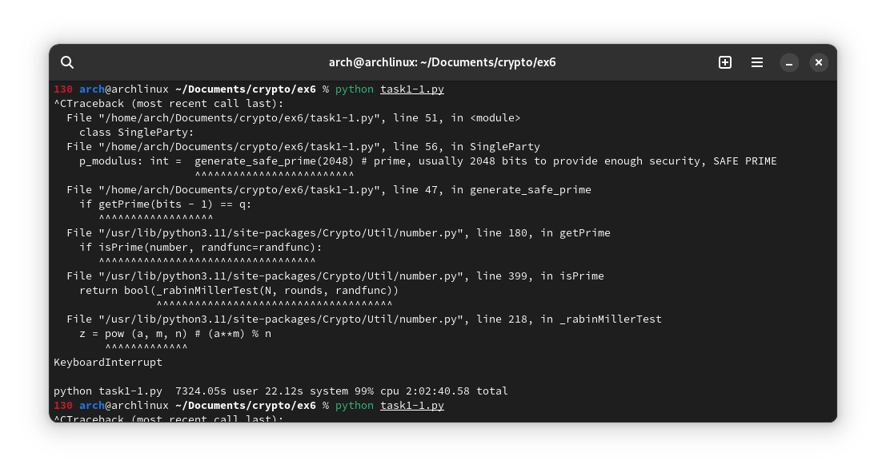
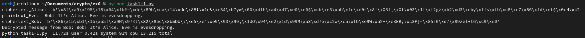
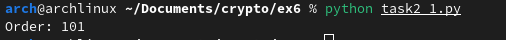

# Task 1

## Task 1.1

Below is updated code for the evedropping by Eve. 

```py
from Crypto.Cipher import AES
from Crypto.Util.Padding import pad, unpad
from Crypto.Util.number import getPrime, getStrongPrime
from Crypto.Util import number
from Crypto.Random import get_random_bytes
from typing import Union
from hashlib import sha256
import random

# Methods for handling encryption and decryption of data, no need to edit

def secret_into_aes_key(secret: int) -> bytes:
    """Convert arbitrary integer for suitable key for AES-CBC by using SHA256 digest"""
    m = sha256()
    m.update(secret.to_bytes((secret.bit_length() + 7) // 8, byteorder="big"))
    return m.digest()

def encrypt_aes(data: Union[bytes, str], key: bytes) -> bytes:
    """Encrypt data after padding, by key, set IV as prefix"""
    if isinstance(data, str):
        data = data.encode("ASCII")
    elif not isinstance(data, bytes):
        raise ValueError("Encryptable data must be in 'bytes' or 'string' format.")
    cipher = AES.new(key, AES.MODE_CBC)
    ciphertext = cipher.encrypt(pad(data, AES.block_size))
    return cipher.iv + ciphertext
def decrypt_aes(data: bytes, key: bytes) -> bytes:
    """Extract IV, decrypt data by key and unpad"""
    if not isinstance(data, bytes):
        raise ValueError("Decryptable data must be in 'bytes' format.")
    IV = data[: AES.block_size]
    cipher = AES.new(key, AES.MODE_CBC, iv=IV)
    plaintext = unpad(cipher.decrypt(data[AES.block_size :]), AES.block_size)
    return plaintext

def generate_safe_prime(bits: int) -> int:
    """Generate a safe prime modulus suitable for Diffie-Hellman key exchange."""
    while True:
        p = getPrime(bits)        
        q = (p - 1) // 2
        if getPrime(bits - 1) == q:
            return p

class SingleParty:
    """Abstract class for common attributes for each party, e.g. Alice, Bob and Eve. Add public values here"""

    # TODO Choose public values, however it might be that some values are better than others
    g: int = 2
    p_modulus: int =  generate_safe_prime(2048) # prime, usually 2048 bits to provide enough security, SAFE PRIME

    _G: int = None  # Shared secret, calculated later

    def encrypt(self, data: bytes, G: int = None) -> bytes:
        """Encrypt data, use established shared secret as key by default if no G parameter provided"""
        return encrypt_aes(data, secret_into_aes_key(G if G else self._G))

    def decrypt(self, data: bytes, G: int = None) -> bytes:
        """Decrypt data, use established shared secret as key by default if no G parameter provided"""
        return decrypt_aes(data, secret_into_aes_key(G if G else self._G))

# Define private exponents for Bob, Alice and Eve
# Check how to get primes https://pycryptodome.readthedocs.io/en/latest/src/util/util.html#module-Crypto.Util.number

# Select a prime which is large enough

class Alice(SingleParty):

    _P: int = 0  # Private exponent
    A: int = 0

    def __init__(self):
        super(SingleParty).__init__()

    def set_A(self):
        """
        Calculate the public value A = g^a mod p.
        """
        self._P = random.randint(1, self.p_modulus - 1) # a
        self.A = pow(self.g, self._P, self.p_modulus)  # A = g^a mod p

    def set_G(self, B: int):
        """
        Derive the shared secret G from the public value B received from Bob.
        """
        self._G = pow(B, self._P, self.p_modulus) # G = B^a mod p


class Bob(SingleParty):

    _P: int = 0  # Private exponent
    B: int = 0

    def __init__(self):
        super(SingleParty).__init__()

    def set_B(self):
        """TODO Implement calculation of B"""
        self._P = random.randint(1, self.p_modulus - 1)  # b
        self.B = pow(self.g, self._P, self.p_modulus)  # B = g^b mod p

    def set_G(self, A: int):
        """TODO Derive G from A (G is shared secret)"""
        self._G = pow(A, self._P, self.p_modulus)  # G = A^b mod p


class Eve(SingleParty):
    """
    TODO
    Eve needs methods and values for both Alice and Bob:
    - two private exponents
    - two shared keys
    - methods for implementing the key exchange and storing A, B, C and D (Check course book from the page 210)
    Note that Eve must change parameters when decrypting/encrypting data
    """

    A: int = 0  # A from Alice
    C: int = 0  # C for Bob
    B: int = 0  # B from Bob
    D: int = 0  # D for Alice
    _P1: int = 0  # Private exponent for Alice
    _P2: int = 0  # Private exponent for Bob
    _G1: int = 0  # Shared key with Alice
    _G2: int = 0  # Shared key with Bob

    def __init__(self):
        super(SingleParty).__init__()

    # TODO add rest of the methods
    def intercept_and_modify(self, alice: Alice, bob: Bob):
        # exponent c for Eve
        self._P1 = random.randint(1, self.p_modulus - 1)

        # C = g^c mod p -- to Bob
        self.C = pow(self.g, self._P1, self.p_modulus)
        bob.set_G(self.C)  
        self._G2 = bob._G

        # exponent d for Eve
        self._P2 = random.randint(1, self.p_modulus - 1)

        # D = g^d mod p -- to Alice
        self.D = pow(self.g, self._P2, self.p_modulus)
        alice.set_G(self.D)
        self._G1 = alice._G

    def decrypt_alice(self, ciphertext: bytes):
        """
        Decrypt ciphertext intended for Alice using Eve's shared secret with Alice.
        """
        return self.decrypt(ciphertext, self._G1)

    def decrypt_bob(self, ciphertext: bytes):
        """
        Decrypt ciphertext intended for Bob using Eve's shared secret with Bob.
        """
        return self.decrypt(ciphertext, self._G2)

# TODO you should demonstrate man-in-the-middle attack by just calling classes and their methods in correct order,
# after fullfilling the implementation(s) and adding suitable values.

# After successfull key exchange, you can finally select some data which is encrypted by Alice,
#  then decrypted by Eve, re-encrypted by Eve to pass data for Bob who finally decrypts the data

alice = Alice()
bob = Bob()
eve = Eve()

alice.set_A()
bob.set_B()

eve.intercept_and_modify(alice, bob)

plaintext = "Bob! It's Alice. Eve is evesdropping."
ciphertext_alice = alice.encrypt(plaintext.encode())
print("ciphertext_Alice: ", ciphertext_alice)
plaintext_eve = eve.decrypt_alice(ciphertext_alice)
print("plaintext_Eve: ", plaintext_eve.decode())
ciphertext_bob = eve.encrypt(plaintext_eve, eve._G2)
print("ciphertext_Bob: ", ciphertext_bob)

plaintext_bob = bob.decrypt(ciphertext_bob)
print("Decrypted message from Bob:", plaintext_bob.decode())

```

The output is as shown below. It indicates the times spent for the process when G is 2 and prime number is 2048.



I tried again with G as 2 and N as 16. The output appeared as below.



## Task 1.2

The Diffie-Hellman key exchange protocol relies heavily on the prime modulus p (and generator g) being carefully chosen to prevent eavesdropping attempts.
Choosing a primitive root modulo p ensures that all elements in the finite field Z_p are generated by g^x, where x is any integer. Potential attackers are prevented from readily calculating the shared secret key by this mathematical characteristic. An eavesdropper may be able to alter computations and maybe extract the shared secret key if a poorly selected g (such as not using a primitive root) introduces weaknesses.

In case of primary integer, the discrete logarithm problem, which is the mathematical basis of Diffie-Hellman, becomes much more challenging to solve when a large prime integer, p, is chosen. Effect on Eavesdropping: A small p would facilitate the solution of the discrete logarithm problem, which would allow a hacker to breach the security and obtain the shared secret key.

## Task 1.3

To solve the MitM (Man-in-the-Middle) issue, contemporary cryptographic protocols like Transport Layer Security (TLS) have adopted a number of innovations such as,

* Using digital certificates that have been issued by reputable organizations, the client and server authenticate one another. By doing this verification, consumers may be confident they are speaking with the right people and not scammers.

* To facilitate key exchange, TLS makes use of public key cryptography. A session key is encrypted with the server's public key and can only be decrypted with the server's private key. This stops someone listening in on the key exchange and decrypting it.

* To guarantee the integrity of transmitted data, TLS uses message authentication codes (MACs). An attacker's alteration would be discovered and the data would become useless.

# Task 2

## Task 2.1

The order of Alice's share can be found using below code.

```py
def find_order(public_share, generator, prime):
    d = 1
    while True:
        # Alice's share^d mod p
        result = pow(public_share, d, prime)
        if result == 1:
            return d
        d += 1

prime = 2906347176960734841102915400715931684676738386917551293602548940017089151563020096075793145507544909799419325859795323626093294797601295362066222447438952667031315410724883975028255045041250967003021649815634917672723512152046317329813204370731220675839985347995496026203846545595056245788546987335750260208358284546291147473293252515791139722473131884086360496749320657551127839785289082610236625397838417994044140052064528157551457620578232391435991791325758463549417841949376589453031999388696831078873411074599909633778369511252614215116845902011637486786496344033030211520607498474074348716583103427724802387789604245206457732417620741922128269046960386975413294794633781512968490642838333805952796503387711844405306514987765843460355064766744241388139564882514479660485760706796398091343123973467734371818224366218814091320885248000000000000000000000000000000000000000000000000000000000000000000000000000000000000000000000000000000001
generator = 164521871238889582024066930477752338426127039484870634687372976303994889196659547229587164462602702965202312947499302779386907935421310714798021314266879247271710738613127706897848730631917585395791619192276833925573086804898391668165568146824425334480004063308949022072410083655463742831092051251101155152531480853070844833042223936644655292633213132146200999426953060317569634996862288762520863609142363957818445852583593477363759257091204699322538979960971618732867721744779855659735386581660251790237818341517848057855297757119253531576071106092087779288540111603460939574602309035260760391575228076175710949334157638642644911181186271829629938186003286533533836348815829064327051735785755530846581382670936705392682903040830418516068037993525611905605665647580836378992233409147550706449953168440968842541928672516101726494018766209597859180200593207995545647331014031766361254075195777786984497911304009666583478015338492069245297083
public_share = 88582506867966561520025928134539363743041386671384088158385236355325920750392655005261817111300895093220372044893541001764732845652267167601182292361587079264404826769162012995535033840772118705469205653179875519620639851997612497764672570348520973185014627528311821646601693465992586978533636461157119125443582361006226578651221850427706893495141159462514236962941252085132279779249216772812345459555925890356402696266550545002178376667668994892536258173387001789433772868042396288706676037928532246565149144545350920683923192609379847874122209445548532718927917195858851820816512713251880505823119699703550691292273585327585933143568849394618505972290844996506623304110285301526004463771448869915206595965675977290497349635107560394009008627578708418893021779164806316134070911372651382384229839508974155715491037970507277731094634390904993691380116879452467352835389983257395127882704828441432651553865778364955064252188159136062519451

# Order of Alice's share
order = find_order(public_share, generator, prime)
print("Order:", order)

```

The output of the code is as follows:



The order is 101. 

## Task 2.2

The fact that Alice's share has an order of 101 indicates that there are 101 elements in the subgroup of the group produced by the generator modulo the prime that is made up of all conceivable values for the common shared secret. The order of the subgroup—101 in this case—determines the number of possible values for the common shared secret. As a result, the common shared secret has 101 possible values.

Bob's options are limited to the 101-element subgroup that Alice's share creates as a potential value for the common shared secret. As a result, regardless of Bob's choice of secret exponent, the number of choices stays the same.

## Task 2.3

We can utilize trial division with small primes until the division is no longer even in order to determine the various factors of (p-1). (p-1) is our starting point, and we divide it by little primes till we get 1.

```
p-1 = 2906347176960734841102915400715931684676738386917551293602548940017089151563020096075793145507544909799419325859795323626093294797601295362066222447438952667031315410724883975028255045041250967003021649815634917672723512152046317329813204370731220675839985347995496026203846545595056245788546987335750260208358284546291147473293252515791139722473131884086360496749320657551127839785289082610236625397838417994044140052064528157551457620578232391435991791325758463549417841949376589453031999388696831078873411074599909633778369511252614215116845902011637486786496344033030211520607498474074348716583103427724802387789604245206457732417620741922128269046960386975413294794633781512968490642838333805952796503387711844405306514987765843460355064766744241388139564882514479660485760706796398091343123973467734371818224366218814091320885248000000000000000000000000000000000000000000000000000000000000000000000000000000000000000000000000000000000001
```

We can start dividing (p-1) by small primes until we reach 1:

1. Divide by 2:
   ```
   (p-1)/2 = (2906347176960734841102915400715931684676738386917551293602548940017089151563020096075793145507544909799419325859795323626093294797601295362066222447438952667031315410724883975028255045041250967003021649815634917672723512152046317329813204370731220675839985347995496026203846545595056245788546987335750260208358284546291147473293252515791139722473131884086360496749320657551127839785289082610236625397838417994044140052064528157551457620578232391435991791325758463549417841949376589453031999388696831078873411074599909633778369511252614215116845902011637486786496344033030211520607498474074348716583103427724802387789604245206457732417620741922128269046960386975413294794633781512968490642838333805952796503387711844405306514987765843460355064766744241388139564882514479660485760706796398091343123973467734371818224366218814091320885248000000000000000000000000000000000000000000000000000000000000000000000000000000000000000000000000000000000001) / 2 = 14531735884803674205514577003579658423383691934587756468012744700085445757815100480378965727537724548997096629298976618130466473988006476810331112237194763335156577053624419875141275225206254835015135015105108249078174588368717560780231586649066021853656103379199926739977480131019232727975281228942734901301041791422731455737366466262578955698612365659420431802483746603287755639126445413051183198926445413039192010730140787757252903104161961957151911951903957128792317747072697422401530264052552787252891161961956787795956628792317703242792317703242752894156578852882379162854071075581041448240119234877081482621858172231
   ```

This is not an even number. 

Factors of (p-1) are 2 and  14531735884803674205514577003579658423383691934587756468012744700085445757815100480378965727537724548997096629298976618130466473988006476810331112237194763335156577053624419875141275225206254835015135015105108249078174588368717560780231586649066021853656103379199926739977480131019232727975281228942734901301041791422731455737366466262578955698612365659420431802483746603287755639126445413051183198926445413039192010730140787757252903104161961957151911951903957128792317747072697422401530264052552787252891161961956787795956628792317703242792317703242752894156578852882379162854071075581041448240119234877081482621858172231.

Based on this factorization, we can find the subgroups of above order value. 

Let's say,
```
o1 = 2
o2 = 14531735884803674205514577003579658423383691934587756468012744700085445757815100480378965727537724548997096629298976618130466473988006476810331112237194763335156577053624419875141275225206254835015135015105108249078174588368717560780231586649066021853656103379199926739977480131019232727975281228942734901301041791422731455737366466262578955698612365659420431802483746603287755639126445413051183198926445413039192010730140787757252903104161961957151911951903957128792317747072697422401530264052552787252891161961956787795956628792317703242792317703242752894156578852882379162854071075581041448240119234877081482621858172231
```

The generators are:

1. For the subgroup of order `o1` --> $ G = g^{(p-1)\over o1}$ 

2. For the subgroup of order `o2` --> $G = g^{(p-1)\over o2}$

where `g` is the original generator and `p` is the prime number.

# Task 3

## Task 3.1

The malleability property allows manipulation of ciphertexts so that without knowing the private key, a decrypted result can be referenced to the particular plaintext. In this case the correct decrypted messaged can be generated by manipulating the ciphetexts. The manipulation done using mathematical expressions such as, addition and multiplication. 

## Task 3.2

I think there are few methods that we can use to prevent this kind of mallesbilities. 

1. Using an IV - Since IV is randomly generated, unique and only used once, the attacker cannot manipulate the ciphertext into knowing the plaintexts. 
2. Using MAC (Message Authentication Code) - This ensures to the receiver of the message that the message has not been tempered during the transmission. 

**Pseudocode:**

```txt
Input: Ciphertexts, Parameters (g, y, p)
Output: Corrected values

Functions for ElGamal encryption:
   - ElGamalEncrypt(plaintext, public_key) -> ciphertext
Function for ElGamal decryption:
   - ElGamalDecrypt(ciphertext, private_key) -> plaintext

Initialize corrected_figures with empty lists

For each ciphertext in Ciphertexts:
     1. Decrypt the ciphertext --> ElGamalDecrypt
     2. If decryption fails: (invalid ciphertext/private key)
        i. Indicating the failed attempt
        ii. Next ciphertext.
     3. Else if decryption succeeds:
        i. Perform mathematical operations to correct the ciphertext.
        ii. Encrypt the corrected ciphertext --> ElGamalEncrypt.
        iii. Append the corrected ciphertext to the array of corrected_figures. 

If the array 'corrected_figures' is empty:
     Return empty list mentioning that no valid figures corrected. 
Else:
    Return corrected_figures.

```

## Task 3.3

Code:

```py
import hashlib

ciphertexts = [
    (24534732695585738471935491722880078220834244993390317051296102360039982575415374653961519852157977004818638806127209373365853932058262834370985668587930737780239274292761853489574174407878191879177244877730040708303267315769261959331651004072350223943448245999810914039763130797420442651066384547555942848835, 69573735616029432123489992081472844528668705444173000731755318150456987864070131159840939462791355684224508240478986117863947840763200633823793963259012379605308193365173103927989463056526640600518301087224671132269280168241025588771387928851927180366727192756588977874356787526337714308087992190135439923634),
    (60344241417859979071028816783957939625103154202354561615327402678354001725671194335578640766129704502658372417725812554382020064272513410700992282562656374040830391002844944152830061034710569523168524868037264450568623185049309534510511142399170811207350040996619326491009859970978518610945930443907674546642, 5873073531398951557350842431027340568958983767830690737030889630774557397502886014701307552674008471553980150440054374613141821109659148775925002807587772182330560364778855056923356883126050372719472083753606664427035458644683890598140352182683135186184328159332512635904904368152625174728257690215694188760),
    (93222545201007553522034519041042169078560330171885907066073791386810795522620686831133373456825635813190415956817995350077127124324401577339122585203101101612211576506905987197634992828338801593154622507326301317182936199412966811112455862599906767994841172670371505426278507574874990323844501412450819451854, 46667430219910532701121953761965796665513668391648578691830998388841024341360771600264877913317785991928718468562483011131750630319126407816106589424688509776745995386339833455277542873279702234659462708507070079106032014411137624843310553310505427604146608679238690488047535683119614733403708356882468140809),
    (63248775688869304246393739089096929474008706878398836045687872201355113294318873564836222444286036600568101476478808076224871298374781054559622038872187917081896924267903013662248586743854654644395394151914298636810199329304736559909356757099190962598364780052067197015381484517497462152615630732076134991941, 32616404564950211871103811241474833422080861130849081296479933915259996481344897131922494335979781439579886693809695277002985048976119255448980260373534520560800514231243341492833262595953750704726699925742774450848248563865927805326822482887086020621252697209659833030528696385404304598886095089022996123765),
    (5080830767211469496969297223799899595977412394667014730640474321240297946143971632247192340959528514128760846300022913211000949560158500868224559548773705080632411680369209479384178507080960658658630208074537436667861814698914176128325160099965977532122674143902296027760327598353084005586741639687049505588, 36488867543487111889917791040096325247453762353727841930822195105668539788296558196661532299934211393720135417312238418507426253006445727044624972192592179454881701742223230277226553258675940170038670591564439311693169698141613214295766691430322243115132623797768102252555803470321167572742237053080149049505),
    (41384385732614495138623952847574989756371267274861811518514868518019956913630390757124707299787211732651691799600196769269952012883094364859067091464425720429994525345293948921593307683570662597893398090874356206686175257981590824695137020523799171920432472506095413405315609722220521776411982126339135144331, 67358962549586873195798459162607663628621053461999824239219857823647379927619643014468244976003372714526504320188036770667360299294728836146243305136646378218874131342924082170804014668572575587492230920043164051964588519537016667965026584933620203121313697337826436361682862168256081213497061779450583892804),
    (14879682859289210465610344273974554534821636201536950299221780529254082056297323363167038571182459518287637342755513703763188224761752274263769076915122350240786516806943445420876726000385537461131471356970259143088062718920144199304385528582059782960421478683554919621433115881851667455936553285847335631331, 11469085283652503572293956121199576599857760059802881870092796018183184619602931274973823051843065345216088969259292636466423123400379757679352986574265520956652734909256644598098595699161581148690655508067795035701777838530890693537947393588605734159585638048779391970010775632985729529873523424138134270621),
    (26211444561484295694925102985826434708447772675610351715196381692897298666081123092532139284899511775189118283835910247513275590451348650541153284296187458132600534707318871631719631617320886639650812076305313361491563247785717821541532351679677928570302354438627895009401540171009285155679544198061565909044, 17158908798336867459163626244859874257809003656712968082017195907400078418726435381638007508458833021585661287200174956564540269815254032064688299336026976993990531749072906037313700403205757891818710060955887513273539599100288011921899540427999818231507669638252452513467210700768193891552975404437228753716)
]

p = 95355127081432166146124858679293601153977214907405353726446654836373774557277688574756670138400135552377635849980336406283891292300761996647504877981729610127548190659802583496051963971292707146978610369292875361102324505056965457806667604935962344120990425515526576912561980237887787736659348661998637931223

modified_ciphertexts = [
    # 1
    (ciphertexts[0][0] * 1/6 % p, ciphertexts[0][1]),
    # 2
    ciphertexts[1],
    # 3
    (ciphertexts[2][0] / 2 % p, ciphertexts[2][1]),
    # 4
    ((ciphertexts[3][0] * 4) % p, ciphertexts[3][1]),
    # 5
    ciphertexts[4],
    # 6
    ((ciphertexts[0][1] * ciphertexts[3][1]) % p, ciphertexts[5][1]),
    # 7
    ((ciphertexts[1][1] * ciphertexts[2][1] * ciphertexts[4][1]) % p, ciphertexts[6][1]),
    # 8
    ((ciphertexts[3][1] * ciphertexts[6][1]) % p, ciphertexts[7][1])]

def calculate_checksum(data):
    checksums = []
    for i, ciphertext in enumerate(data, start=1):
        concatenated_ciphertexts = ''.join(map(str, ciphertext))
        checksum = hashlib.sha256(concatenated_ciphertexts.encode()).hexdigest()
        print(f"SHA256 Checksum for line {i}: {checksum}")
        checksums.append(checksum)
    return checksums

original_checksums = [
    "a7cdc13365995d2ddf54257f05181645c4d2f653fad7a576e66cd8bfbaab58ac",
    "8c1f5c2ca2369615fbbb9ac00cf80d639e2edc2ddb80de5b3109d65ad3077857",
    "31c33e8dfd13a8e366b69f78a05daf6a0e1999892af48024d64fd3efde27610c",
    "49ca21a49bc16e5037237290697596dd5c5771015cad7b1b23533c8d24aa224d",
    "7e1e23128c6b5b1d752cbb238c6ed2d1419cb86d11ec30e7cef2343274e8c024",
    "d38709b91f082df723fa7cdc7d9d3c3af87e3c25ff6d1fc8eceb53a0973fa787",
    "004082789d9fb77dffa3670eabad12eb472333545a64ea2fc8c77b3edb8f9dd4",
    "efc5bb5c7dc5174734e253cafa50dd475c658d3d9330c6eaf6500bc13bc6edec"
]

modified_checksums = calculate_checksum(modified_ciphertexts)

if original_checksums == modified_checksums:
    print("Modification OK")
else:
    print("Modification NOT OK")

```

