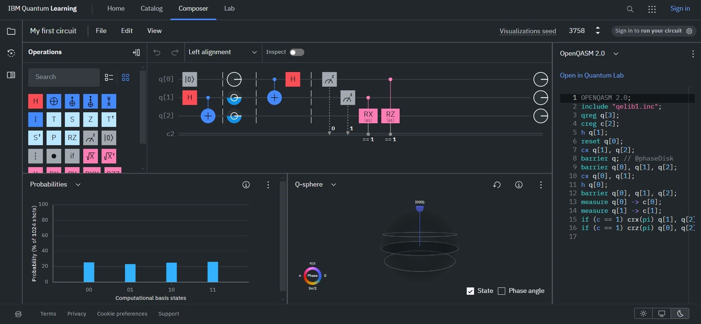
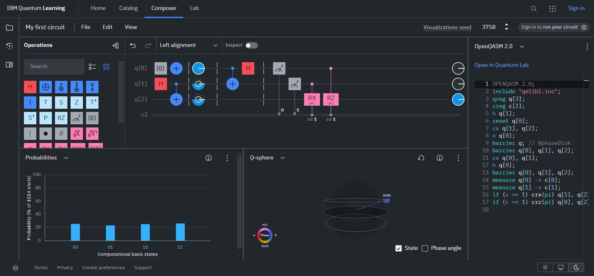
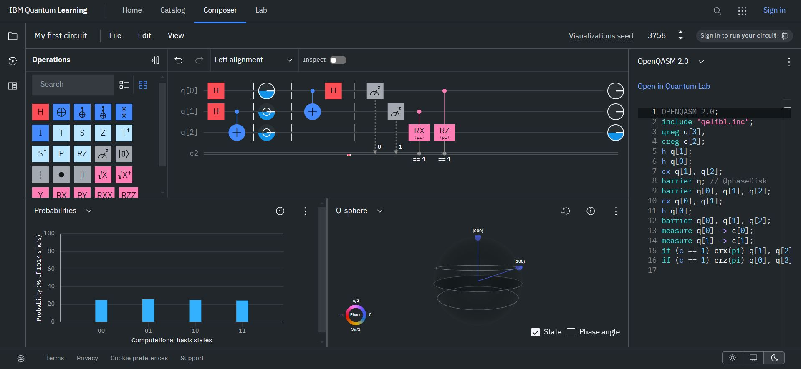
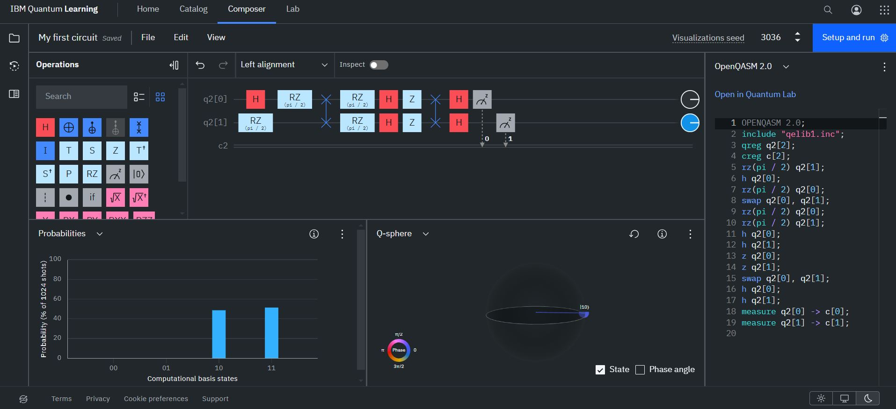

# Task 1

**1. What did you like about the lectures?**

The content is interesting. Going through the lectures in our own time was also good for me. The lectures were described clearly and could be understood with the help of the course book as well. 

**2. What would you improve on the lectures?**

None

**3. What did you like about the exercises?**

I found it interesting and a bit hard in the later part. There could be more hints on the task to carry out the task. 

**4. How would you improve the exercises?**

Going through the exercise at the end of the marking.

**5. Did you miss some type of an exercise or some content as an exercise?**

Yes, for me, it was too time-consuming since I am a beginner in programming and still learning. 

**6. What was missing from the course (i.e. what more would you have wanted from the course)?**

None

**7. What was the worst part of the course in your opinion?**

None 

**Freeform feedback on the course**

# Task 2

## Task 2.1

I created a transportation circuit referring to a tutorial. This The Hadamard gate creates the superpositions. the CNOT gate creates the entanglement with the input. 

The circuit described is a quantum teleportation circuit. It's designed to transfer the state of one qubit (q0) to another qubit (Q2), which is physically separated from the first qubit.

Alice and Bob initially entangle two qubits, qubit 1 (q1) and qubit 2 (Q2), creating a Bell state. Alice prepares the qubit she wants to teleport (q0) by applying operations to it. Alice measures q0 and q1. The results of these measurements are then transmitted to Bob through classical communication. Based on the measurements received from Alice, Bob performs operations on Q2 to recreate the state of q0. After Bob performs his operations, Q2 will be in the same state as q0 was initially. 

The figure below shows that the qubit Q2 is equal to qubit Q0 when it equals 1, 0, and superposition.  

Q0 = 0:

Q1 = 1:

Q1 = Superposition:

## Task 2.2

The input/output table is as follows. 

| q2[0] input | q1[1] input | q2[0] output | q1[1] output |
|-------------|-------------|--------------|--------------|
| H | H | 0 | 0 |
| 0 | H | 1 | 0 |
| 0 | 0 | 1 | 1 |
| H | 0 | 0 | 1 |

The below image shows when the circuit produces 0 and 1 for the q2[0] and q2[1]. 

# Task 3

**Post-quantum Cryptography (Option 1)**

The finalists of round 3 have submitted the proposals for the round 4. The algorithms are;
1. BIKE
2. Classic McEliece
3. HQC
4. SIKE

